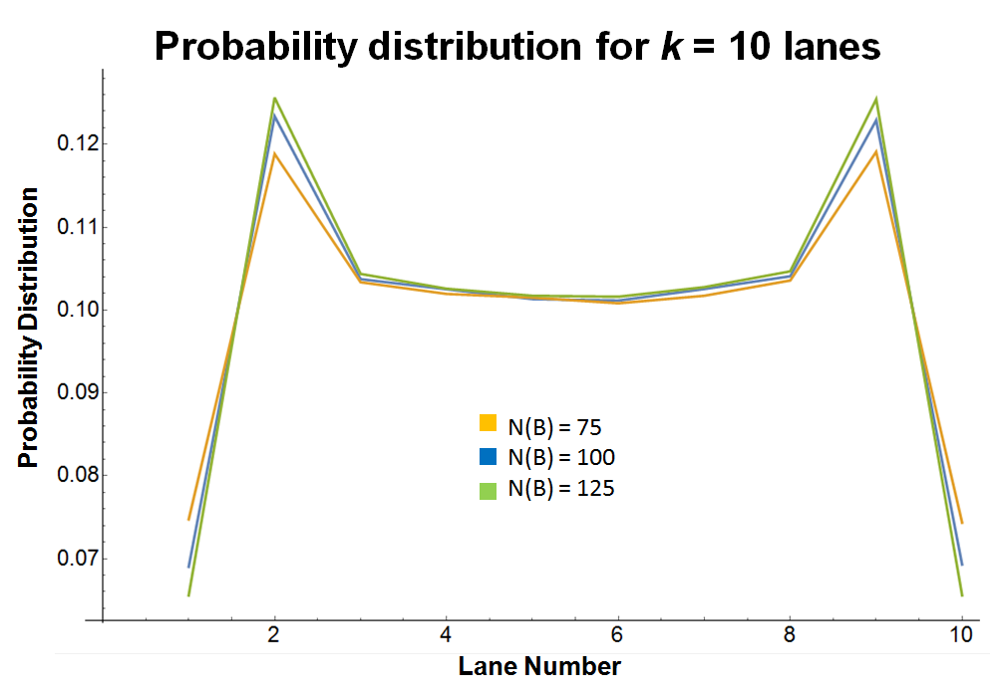
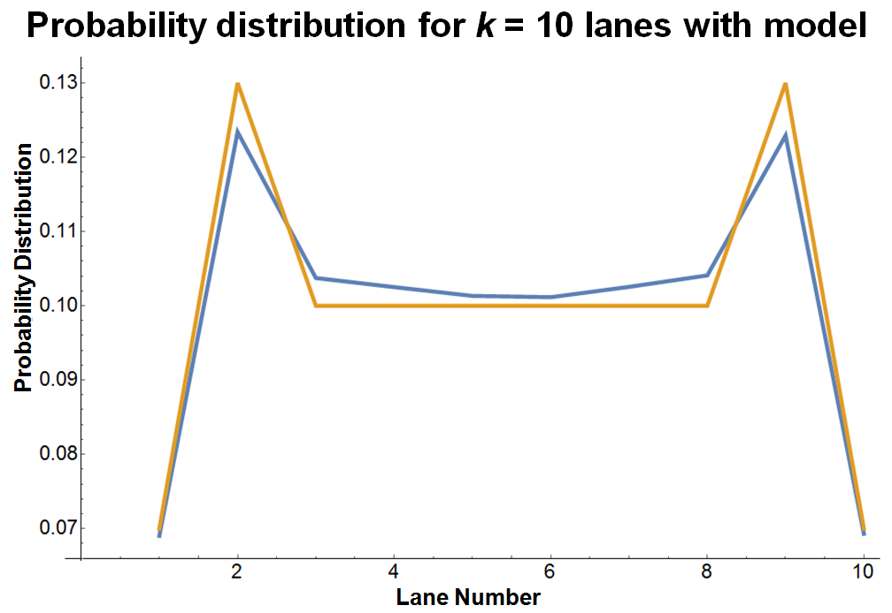

# SIMC Section C: Busy footbridge

This is a followup project after Singapore International Mathematics Challenge (SIMC) 2018 to calculate the numerical answers to Section C using programming.
The simulation is done using C++, while the analysis and graphs are done using Wolfram Mathematica.
Also, an analysis of Model 3 of the Champion Team's report (NUSH) was also done.

The problem statement may be found in [SIMC_Part_C.pdf](https://github.com/jianzhi-1/simc_c/blob/master/SIMC_Part_C.pdf).

A summary of the results as well as the derivations could be found [here](https://github.com/jianzhi-1/simc_c/blob/master/SIMC%20Part%20C%20Solution.pdf).

## Main Results

- **Question 3**
Attempted to use recursion to solve the problem. For the first and second A, recursion yielded the correct result. 
Further recursions led to a deviation from simulation results. This may be because when considering events in the recursion, some events 
may actually not be independent from each other, and hence a more careful approach may need to be used.

- **Question 4**

The champion team's model involved k lanes instead of 2. For this part, I analysed the distribution of people along the k lanes 
by dividing the number of people ending at a lane over the total number of people. Except for small values of k, greater values 
of k always resulted in a spike in probability distribution in the 2nd and (k-1)th row (1-indexed) as compared to the rest of the rows. 
The 1st and kth row have the lowest probability distribution. Otherwise, the probability distribution is generally equal.

The figure below shows a graph of probability distribution against lane number when k = 10:

The simulation results was fitted to obtain fitting functions. A more quantitative (but very simplified) model was proposed, which models the 
shape of the general graph quite well.

Project ended on 12/06/2018