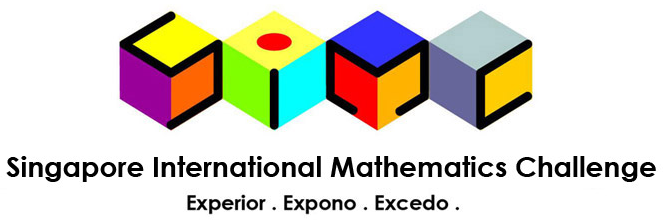

# SIMC Section C: Busy footbridge

This is a followup project after Singapore International Mathematics Challenge (SIMC) 2018 to calculate the numerical answers to Section C using programming.
The simulation is done using C++, while the analysis and graphs are done using Wolfram Mathematica.
Also, an analysis of Model 3 of the Champion Team's report (NUSH) was also done.

The problem statement may be found in SIMC_Part_C.pdf

A summary of the results as well as the derivations could be found in <insert file name>.

## Summary of Results
- Question 1
The model used is the polite and stubborn model, where a polite person must give way while a stubborn person does not give way.

- Question 2

- Question 3

- Question 4
The champion team's model involved k lanes instead of 2. 